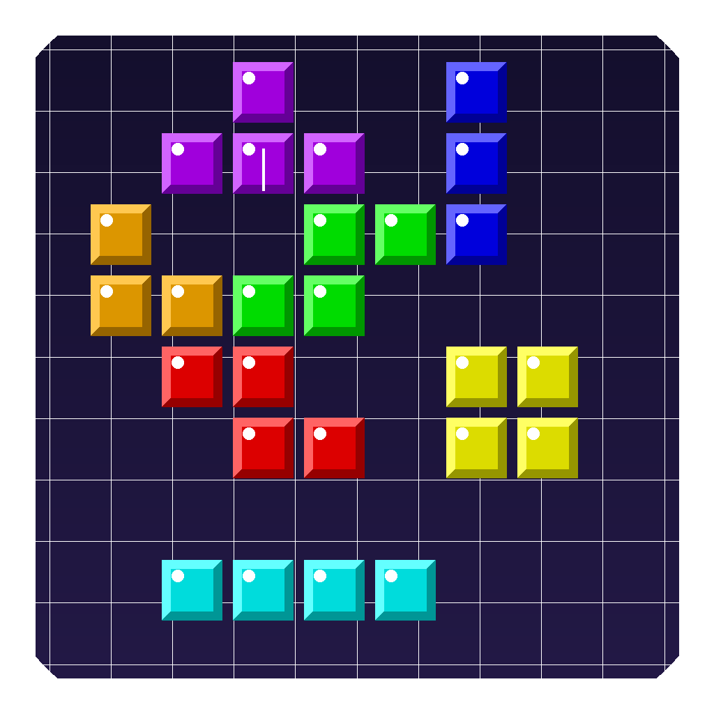

# Тетріс

Класичний Тетріс на C++ з використанням SDL2.



## Можливості

- Класична механіка Тетріс з SRS-ротацією
- Звукові ефекти (генеруються програмно, без зовнішніх файлів)
- Система рівнів та очок
- Hold-фігура (клавіша C)
- Попередній перегляд наступних фігур
- Візуальні ефекти при очищенні ліній
- Пауза (P) та перезапуск (R)

## Керування

| Клавіша | Дія |
|---------|-----|
| ← → | Рух вліво/вправо |
| ↓ | Прискорення |
| ↑ | Поворот |
| Space | Жорстке падіння |
| C | Hold-фігура |
| P | Пауза |
| R | Перезапуск (після Game Over) |
| Esc | Вихід |

## Завантажити

- **macOS**: [Тетріс.app](https://github.com/sanyarud/tetris/releases) (Universal)
- **Windows**: [Tetris-Windows.zip](https://github.com/sanyarud/tetris/releases) (32-bit, MSVC)

## Збірка з вихідного коду

### macOS

```bash
brew install sdl2 sdl2_ttf sdl2_mixer
make
./tetris
```

### Windows

Windows-збірка автоматично створюється через GitHub Actions (MSVC + vcpkg).
Також можна зібрати локально з Visual Studio:

```bash
vcpkg install sdl2 sdl2-ttf sdl2-mixer --triplet x86-windows
cl.exe /std:c++17 /O2 /EHsc /D_USE_MATH_DEFINES /I <vcpkg_include> /I <vcpkg_include>/SDL2 main.cpp /Fe:tetris.exe /link /LIBPATH:<vcpkg_lib> SDL2main.lib SDL2.lib SDL2_ttf.lib SDL2_mixer.lib shell32.lib /SUBSYSTEM:WINDOWS
```

## Технології

- C++17
- SDL2, SDL2_ttf, SDL2_mixer
- Програмна генерація звуку (без зовнішніх аудіофайлів)

## Автор

**sanyarud**
